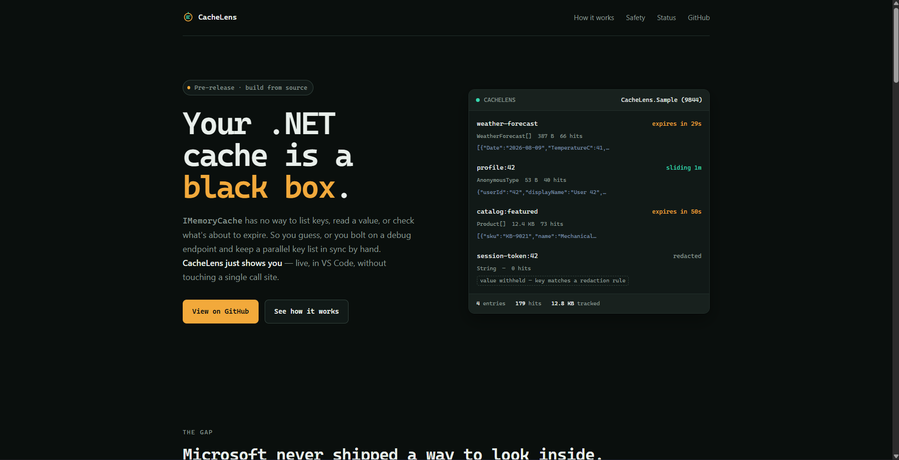

<div align="center">


# CacheLens

**See what's actually inside your .NET cache.**

`IMemoryCache` gives you no way to list keys, read a value, or check what's about to expire.
CacheLens does — live, in VS Code, without changing a single line of your caching code.

[](LICENSE)
[](https://dotnet.microsoft.com/)
[](https://code.visualstudio.com/)
[](#project-status)

[Install](docs/INSTALLATION.md) · [Contribute](CONTRIBUTING.md) · [Architecture](docs/architecture.md)



</div>

---

## The problem

`MemoryCache` keeps its entries in a private dictionary. There is no public way to enumerate
them. So when you need to answer *"what is actually cached right now?"*, you end up doing this:

```csharp
// Keep a shadow copy of every key you ever set…
private static readonly HashSet<string> _keys = new();

app.MapGet("/debug/cache", (IMemoryCache cache) =>
{
    // …then hope it still matches reality.
    // Evictions don't tell you. TTLs aren't here. Sizes aren't here.
    return _keys.Where(k => cache.TryGetValue(k, out _));
});
```

That list drifts out of sync the moment an entry expires on its own.

## The fix

```csharp
if (builder.Environment.IsDevelopment())
{
    builder.Services.AddCacheLens();
}

// ...

if (app.Environment.IsDevelopment())
{
    app.MapCacheLens();
}
```

Run your app, open the CacheLens panel in VS Code, and every key is there — with its value,
size, expiry countdown, and read count. **Your existing `Set` / `Get` / `GetOrCreate` calls stay
exactly as they are.**

---

## What you get

| | |
|---|---|
| **Live key browser** | Every tracked key, with size, time-to-live, and hit count at a glance |
| **Value inspector** | Click a key to read its value as formatted JSON, with full metadata |
| **Expiry you can watch** | Absolute and sliding expirations render as live countdowns |
| **Evict without restarting** | Drop one key or clear everything, then watch it repopulate |
| **Zero configuration** | Your app announces itself; the extension finds it. No ports or tokens to type |
| **Secrets stay secret** | Keys that look secret-shaped never send their value to your editor |

---

## Quick start

**1. Install the extension** — search for *CacheLens* in the VS Code Extensions panel.

**2. Add the package to your app:**

```bash
dotnet add package CacheLens.AspNetCore
```

**3. Wire it up** — the two `if` blocks shown above, in `Program.cs`.

**4. Run your app** and open the CacheLens panel.

Full walkthrough, settings, and troubleshooting: **[docs/INSTALLATION.md](docs/INSTALLATION.md)**

---

## Built for safety

A tool that displays cache contents is a data leak waiting to happen, so CacheLens fails closed
by default:

- **Development only** — the standard setup keeps it off outside development.
- **Loopback only** — requests from other machines are refused, regardless of what address your
  app is bound to.
- **Fresh token per run** — each process generates a random bearer token; the extension reads it
  automatically, you never type it.
- **Secret-shaped keys redacted** — keys containing `password`, `token`, `secret` and similar
  send metadata only, never the value.
- **Large values capped** — anything over 64 KB is reported by size rather than shipped to your
  editor.

---

## How it works

CacheLens is two independently versioned halves joined by a small documented protocol.

```
┌──────────────────────────────┐                      ┌─────────────────────────────┐
│  Your ASP.NET Core app       │   localhost only     │   VS Code extension          │
│                              │   token-protected    │                              │
│  AddCacheLens() wraps your   │ ───────────────────► │  Watches for the discovery   │
│  existing IMemoryCache and   │                      │  file, reads the endpoint,   │
│  tracks entries in a         │   discovery file     │  renders the key tree and     │
│  side-index                  │ ───────────────────► │  value inspector              │
└──────────────────────────────┘                      └─────────────────────────────┘
```

The package keeps its **own index** of cache entries rather than reflecting into `MemoryCache`
internals, because those internals are not a stable, supported surface across .NET versions.

Design decisions and trade-offs: **[docs/architecture.md](docs/architecture.md)**

---

## Repository layout

```
packages/dotnet/CacheLens.Core         Shared contracts and wire protocol
packages/dotnet/CacheLens.AspNetCore   The NuGet package users install
packages/vscode-extension              The VS Code extension
samples/CacheLens.Sample               Sample app for testing
site/                                  Product website (static HTML)
docs/                                  Architecture, install guide, brand
```

---

## Project status

CacheLens is **pre-release**. Here is exactly where it stands:

| Status | Feature |
|---|---|
| ✅ Working | `IMemoryCache` tracking — values, TTLs, hit counts, evict, clear |
| ✅ Working | Zero-config discovery, key tree, value inspector, snapshot export |
| 🔜 Next | Live push updates (currently polls every 3 seconds) |
| 🔜 Next | Publishing to NuGet, VS Code Marketplace, Open VSX |
| 📋 Planned | `IDistributedCache` and `HybridCache` support |
| 📋 Planned | Automated test suite |

---

## Contributing

Contributions are welcome. [CONTRIBUTING.md](CONTRIBUTING.md) walks through getting the project
running locally, how the two halves fit together, and where to make specific kinds of changes.

Good first contributions: an automated test suite, `IDistributedCache` support, or improving
these docs.

---

## License

[MIT](LICENSE) — free to use, modify, and distribute.
