# CacheLens — Architecture

A complete explanation of what CacheLens does, why it exists, how it is built, and how people
get it. Written to be readable start to finish, with no prior knowledge of the project.

**Contents**

1. [The problem, honestly stated](#1-the-problem-honestly-stated)
2. [What else exists — the market](#2-what-else-exists--the-market)
3. [End-to-end walkthrough](#3-end-to-end-walkthrough)
4. [System architecture](#4-system-architecture)
5. [How we solved the enumeration problem](#5-how-we-solved-the-enumeration-problem)
6. [A real bug worth knowing about](#6-a-real-bug-worth-knowing-about)
7. [Zero-configuration discovery](#7-zero-configuration-discovery)
8. [Security model](#8-security-model)
9. [The wire protocol](#9-the-wire-protocol)
10. [Folder and file structure](#10-folder-and-file-structure)
11. [How users get CacheLens](#11-how-users-get-cachelens)
12. [Status and roadmap](#12-status-and-roadmap)

---

## 1. The problem, honestly stated

### What .NET actually gives you

This section is deliberately precise, because the honest version of the problem is narrower than
the marketing version — and the honest version is still worth solving.

Everything below was verified by compiling against each framework, not read from a blog post:

| Capability | .NET 8 | .NET 9+ | Notes |
|---|---|---|---|
| `MemoryCache.Keys` | ❌ Does not exist | ✅ Exists | Returns `IEnumerable<object>` — **keys only** |
| `MemoryCache.Count` | ❌ | ✅ | Entry count |
| `GetCurrentStatistics()` | ✅ | ✅ | Aggregate hits/misses/size. Requires `TrackStatistics = true` |
| `IMemoryCache.Keys` | ❌ | ❌ | **The interface has no `Keys`, even on .NET 9** |

Two things follow from that table, and they are the whole reason this project exists.

**First: `Keys` gives you keys, and nothing else.** There is no built-in way to ask "when does
this key expire?", "how big is it?", "how many times has *this specific key* been read?", or
"when was it last touched?". `GetCurrentStatistics()` gives you totals across the entire cache,
never per-key detail. To see a value you must call `TryGetValue` for each key yourself.

**Second: `Keys` is on the concrete `MemoryCache` class, not the `IMemoryCache` interface.**
Standard dependency injection hands your code an `IMemoryCache`. So even on .NET 9, the
idiomatic way of receiving a cache cannot enumerate it without a downcast that may fail if
anything else has already wrapped the cache.

And on **.NET 8 — still a supported LTS release in wide production use — none of it exists.**

### So what is actually missing


CacheLens fills the right-hand box: **per-key metadata, plus somewhere to see it.**

### The workaround this replaces

Without CacheLens, teams keep a parallel list of keys by hand:

```csharp
private static readonly HashSet<string> _keys = new();

// Every cache write has to remember to also record the key…
_cache.Set("user:42", user);
_keys.Add("user:42");

app.MapGet("/debug/cache", (IMemoryCache cache) =>
    _keys.Where(k => cache.TryGetValue(k, out _)));
```

This drifts out of sync the moment an entry expires or is evicted under memory pressure, because
nothing tells `_keys` that happened. It also carries no expiry, size, or hit information.

---

## 2. What else exists — the market

An honest look at the alternatives, and why none of them cover this.

| Tool | What it does | Why it does not solve this |
|---|---|---|
| **RedisInsight**, **Another Redis Desktop Manager** | Excellent GUIs for browsing Redis keys and values | Redis only. `IMemoryCache` lives *inside your process* and speaks no network protocol |
| **dotnet-counters**, **dotnet-monitor** | Live EventCounters from a running .NET process | Aggregate numbers — cache hit ratio, entry count. No keys, no values |
| **.NET Aspire Dashboard** | Traces, logs and metrics for distributed apps | Telemetry-oriented. Does not enumerate in-process cache contents |
| **Application Insights / OpenTelemetry** | Metrics and distributed tracing | Same limitation: aggregates, not cache contents |
| **Visual Studio / Rider debugger** | Can inspect `MemoryCache` private fields in a watch window | Requires pausing execution, and depends on internal field names. Not a live view |
| **dotMemory**, **PerfView** | Memory profilers | Show objects on the heap, with no understanding of cache semantics like TTL |
| **Glimpse** (discontinued) | Had a cache tab for the old ASP.NET `HttpRuntime.Cache` | Dead since the .NET Framework era. Nothing replaced it for `IMemoryCache` |
| **Hand-rolled debug endpoint** | The `HashSet<string>` pattern above | Drifts out of sync; no metadata; rebuilt from scratch in every project |

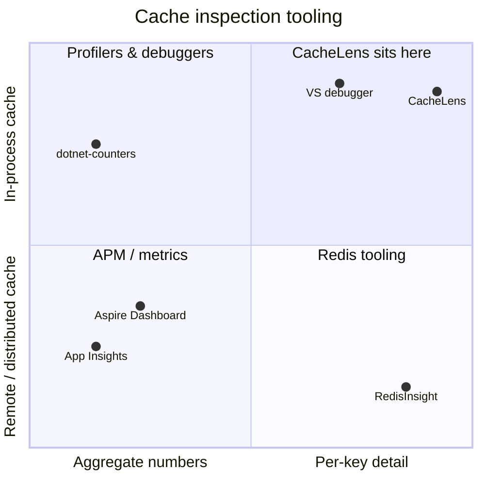

**The gap in one sentence:** Redis has had a great key browser for a decade; the cache sitting
inside your own process has never had one.

---

## 3. End-to-end walkthrough

Let us follow one real cache entry from creation to inspection.

**The application code** (from `samples/CacheLens.Sample/Program.cs`):

```csharp
app.MapGet("/weatherforecast", (IMemoryCache cache) =>
{
    return cache.GetOrCreate("weather-forecast", entry =>
    {
        entry.AbsoluteExpirationRelativeToNow = TimeSpan.FromSeconds(30);
        return GenerateForecast();
    });
});
```

Nothing here mentions CacheLens. That is the point — instrumentation is invisible to your code.

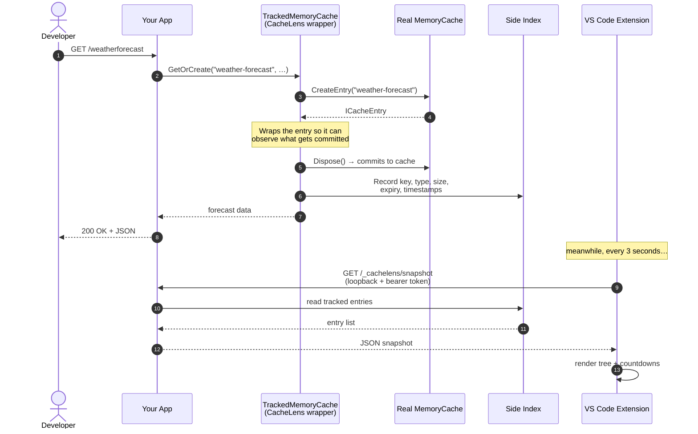

**What the developer sees in VS Code**, a second later:

```
CacheLens.Sample (16652)          3 entries
├── weather-forecast    387 B · 0 hits · expires in 29s
├── profile:42           53 B · 0 hits · sliding 300s
└── 🔒 session-token:42     — · 0 hits · expires in 5m
```

Clicking `weather-forecast` opens an inspector showing the formatted JSON value, its type
(`WeatherForecast[]`), exact timestamps, and buttons to refresh, copy, or evict it.

The `🔒` on `session-token:42` means the value was **never sent to the editor** — the key matched
a redaction rule. You can see the entry exists and how it is configured, but not its contents.

---

## 4. System architecture

CacheLens is two independently versioned programs joined by a small documented protocol.

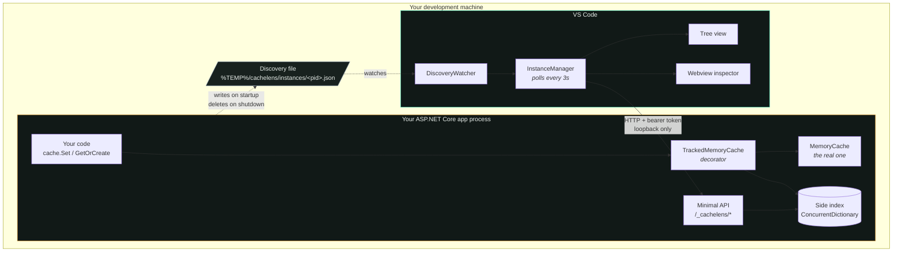

### Why two separate pieces

They have different release cadences and different audiences. A team may upgrade the VS Code
extension without touching their app's NuGet package, or vice versa. Splitting them means neither
blocks the other — and the `/meta` handshake (see [§9](#9-the-wire-protocol)) lets each side
detect a version mismatch and say so clearly instead of failing in confusing ways.

---

## 5. How we solved the enumeration problem

This is the core engineering decision in the project.

### The options considered

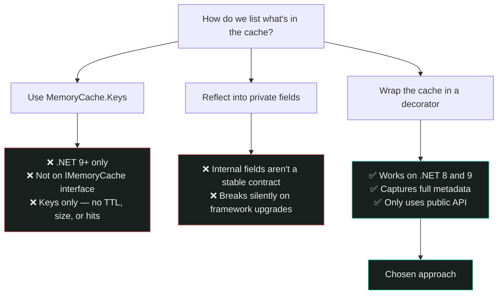

### The decorator

`TrackedMemoryCache` implements `IMemoryCache` and wraps whatever real cache was already
registered. Every write passes through it, so it can maintain its own index.

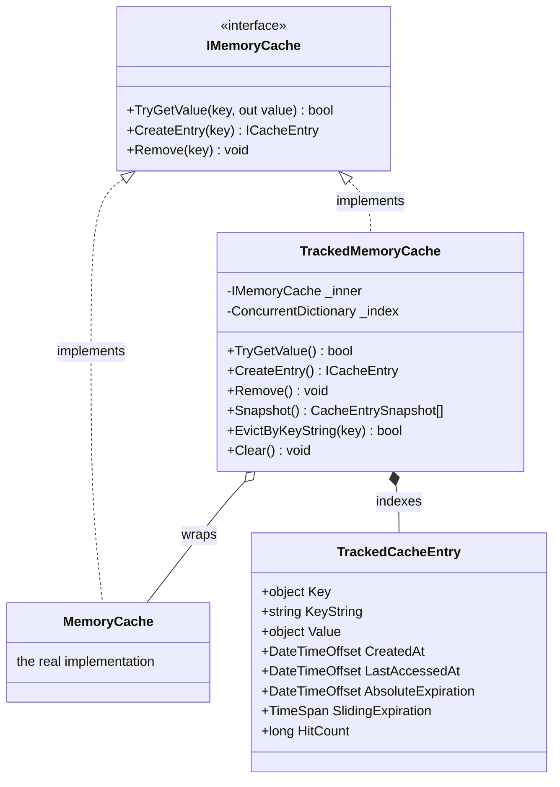

### Swapping it in without touching your code

`AddCacheLens()` finds the existing `IMemoryCache` registration in the DI container, rebuilds
the original from its own `ServiceDescriptor`, and wraps that:

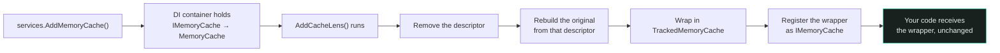

Rebuilding from the original descriptor matters: it preserves whatever the app configured
(size limits, compaction settings, a custom implementation) instead of silently replacing it
with a second, disconnected cache.

**Source:** [`ServiceCollectionExtensions.cs`](../packages/dotnet/CacheLens.AspNetCore/ServiceCollectionExtensions.cs)

### Why the entry wrapper is needed

`IMemoryCache.CreateEntry()` returns an `ICacheEntry` that only actually commits to the cache
when it is **disposed**. That is also the moment `AbsoluteExpirationRelativeToNow` gets resolved
into a concrete `AbsoluteExpiration`. So CacheLens wraps the entry too, and reads the final
values *after* calling `Dispose()` on the inner entry — reading before would capture incomplete
data.

---

## 6. A real bug worth knowing about

Worth documenting because the fix is non-obvious and easy to reintroduce.

`MemoryCache` invokes post-eviction callbacks **asynchronously on the thread pool**, not inline.
When a key expires and is immediately recreated, the old entry's eviction callback can run
*after* the new entry has already been committed:

```mermaid
sequenceDiagram
    participant T1 as Request thread
    participant Idx as Side index
    participant TP as Thread pool

    Note over Idx: index["weather"] = Entry A
    Note over TP: Entry A expires…
    T1->>Idx: recreate → index["weather"] = Entry B
    Note over Idx: index now correctly holds Entry B
    TP-->>Idx: Entry A's eviction callback fires (late!)
    rect rgb(90, 30, 35)
        Note over Idx: Naive: _index.TryRemove("weather")<br/>deletes Entry B — the WRONG entry
    end
    Note over Idx: Key vanishes from the viewer<br/>even though it is cached
```

**The fix** is an identity-checked removal — only remove if the index still holds *this exact*
entry instance:

```csharp
private void OnEntryEvicted(object key, TrackedCacheEntry entry) =>
    ((ICollection<KeyValuePair<object, TrackedCacheEntry>>)_index)
        .Remove(new KeyValuePair<object, TrackedCacheEntry>(key, entry));
```

That `ICollection` cast exposes `ConcurrentDictionary`'s compare-and-remove overload, which
removes only when both key *and* value match.

Caught with a targeted reproduction: expire and recreate the same key in a tight loop. The naive
version failed on ~30 of 200 iterations; the fixed version passed all 200.

**Source:** [`TrackedMemoryCache.cs`](../packages/dotnet/CacheLens.AspNetCore/TrackedMemoryCache.cs)

---

## 7. Zero-configuration discovery

The feature that makes CacheLens feel effortless: you never type a host, port, or token.

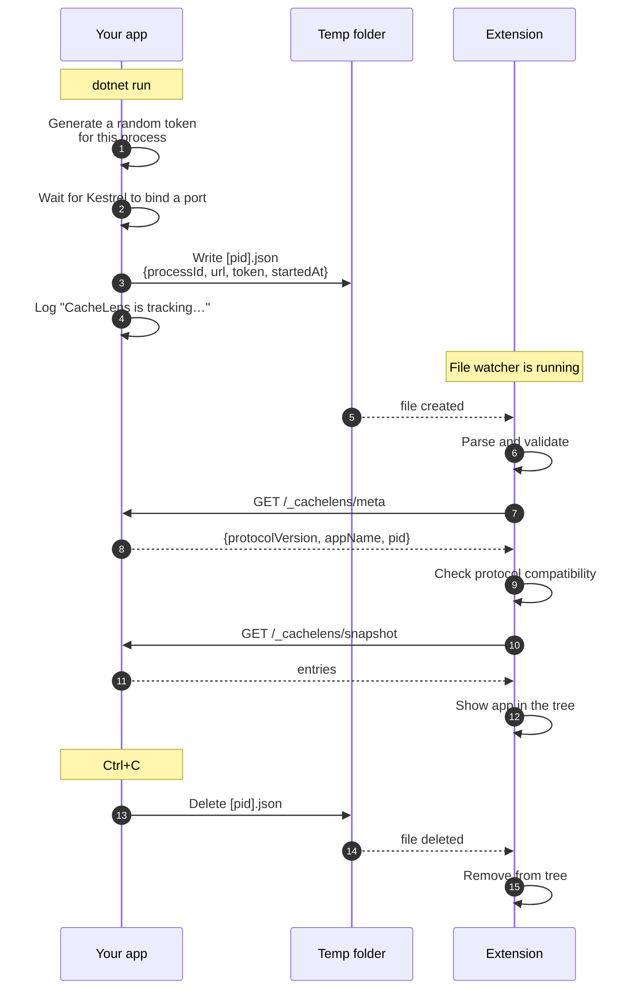

The approach mirrors how the .NET diagnostics IPC and the Aspire dashboard find running
processes.

**One known rough edge:** if an app is killed forcefully (`kill -9`, Stop-Process -Force, or a
crash), the shutdown hook never runs and the file is left behind. The extension then shows that
app as *unreachable* with a 401, because a different process now owns that port and the old token
no longer works. Deleting the stale file and refreshing clears it. A future version should
validate liveness by PID.

**Sources:** [`CacheLensDiscoveryHostedService.cs`](../packages/dotnet/CacheLens.AspNetCore/CacheLensDiscoveryHostedService.cs) ·
[`discovery.ts`](../packages/vscode-extension/src/discovery.ts)

---

## 8. Security model

A tool that displays cache contents is a data-leak risk, so every request runs a gauntlet:

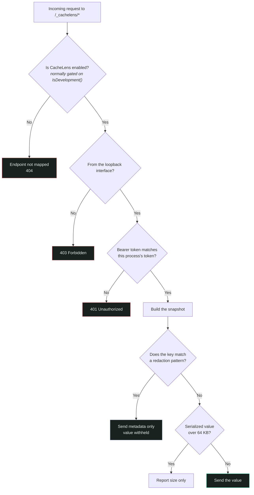

Every layer is **on by default**. Defaults, in order of importance:

| Control | Default | Why |
|---|---|---|
| Environment gate | Documented setup wraps registration in `IsDevelopment()` | Keeps it out of production entirely |
| Loopback check | `IPAddress.IsLoopback` on every request | Holds even if Kestrel binds `0.0.0.0` |
| Bearer token | New random value every process start | A stale token from a previous run fails |
| Key redaction | `password`, `secret`, `token`, `apikey`, `connectionstring`, `credential` | Secrets stay out of the editor |
| Payload cap | 64 KB | Avoids shipping large blobs |

**One thing to watch:** *Export Snapshot* writes real cached values to a file on disk. That file
is covered by `.gitignore`, but check its contents before attaching it to a bug report.

---

## 9. The wire protocol

All endpoints sit under a configurable prefix, `/_cachelens` by default.

| Method | Path | Purpose |
|---|---|---|
| `GET` | `/meta` | Handshake — protocol version, app name, PID, package version |
| `GET` | `/snapshot` | All tracked entries with metadata |
| `POST` | `/evict/{key}` | Remove one entry |
| `POST` | `/clear` | Remove everything tracked |

### Version negotiation

The two halves version independently, so they will drift apart in the wild.

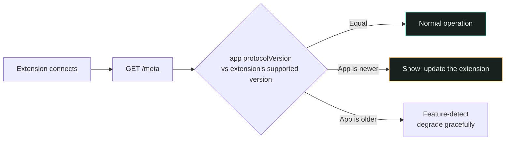

The version constant lives in
[`ProtocolVersion.cs`](../packages/dotnet/CacheLens.Core/ProtocolVersion.cs) and its TypeScript
mirror in [`types.ts`](../packages/vscode-extension/src/types.ts). **These two files describe the
same data in two languages and must be changed together.**

---

## 10. Folder and file structure

```
CacheLens/
│
├── packages/
│   ├── dotnet/
│   │   ├── CacheLens.Core/                    Shared contracts — no dependencies
│   │   │   ├── CacheEntrySnapshot.cs          One cache entry as sent over the wire
│   │   │   ├── CacheKind.cs                   Memory / Distributed / Hybrid
│   │   │   ├── CacheLensInstanceFile.cs       Discovery file shape + directory location
│   │   │   ├── HandshakeInfo.cs               Response body for GET /meta
│   │   │   └── ProtocolVersion.cs             ⚠️ Mirrored in types.ts
│   │   │
│   │   ├── CacheLens.AspNetCore/              The package users install
│   │   │   ├── TrackedMemoryCache.cs          ⭐ The decorator — core of the project
│   │   │   ├── TrackedCacheEntry.cs           One tracked entry in the side index
│   │   │   ├── CacheLensRegistry.cs           Aggregates tracked caches
│   │   │   ├── CacheLensOptions.cs            Redaction, size caps, route prefix
│   │   │   ├── CacheLensRuntimeState.cs       Per-process bearer token
│   │   │   ├── ServiceCollectionExtensions.cs AddCacheLens() — the DI swap
│   │   │   ├── CacheLensEndpointExtensions.cs MapCacheLens() — endpoints + auth
│   │   │   └── CacheLensDiscoveryHostedService.cs   Writes/removes the discovery file
│   │   │
│   │   └── icon.png                           Shared NuGet package icon
│   │
│   └── vscode-extension/                      The VS Code extension
│       ├── src/
│       │   ├── extension.ts                   Entry point, command registration
│       │   ├── types.ts                       ⚠️ Mirrors CacheLens.Core
│       │   ├── discovery.ts                   Watches the instance directory
│       │   ├── apiClient.ts                   HTTP calls to /_cachelens/*
│       │   ├── instanceManager.ts             Connection state + 3s polling
│       │   ├── format.ts                      Sizes, countdowns, relative times
│       │   ├── statusBar.ts                   Summary in the status bar
│       │   ├── views/
│       │   │   └── treeDataProvider.ts        The key tree
│       │   └── webview/
│       │       └── inspectorPanel.ts          The value inspector panel
│       ├── media/
│       │   ├── icon.svg                       Activity Bar icon (monochrome — required)
│       │   ├── icon-128.png                   Marketplace listing icon
│       │   └── logo.svg                       Full-colour brand mark
│       ├── package.json                       Manifest: commands, views, menus
│       ├── esbuild.js                         Bundler config
│       └── README.md                          → becomes the Marketplace listing
│
├── samples/
│   └── CacheLens.Sample/                      Test app: absolute + sliding + redacted keys
│
├── site/
│   └── index.html                             Product website (self-contained, no build)
│
├── docs/
│   ├── architecture.md                        This file
│   ├── INSTALLATION.md                        Guide for people using CacheLens
│   ├── brand.md                               Colour palette and typography rationale
│   └── images/
│
├── CONTRIBUTING.md                            Guide for people working on CacheLens
├── README.md                                  Project front page
├── vercel.json                                Static site deploy config
└── CacheLens.slnx                             Solution file
```

⭐ = start here if you are new to the codebase
⚠️ = must be changed together with its counterpart

---

## 11. How users get CacheLens

Users need **both halves**. The package instruments the app; the extension displays it. Neither
is useful alone.

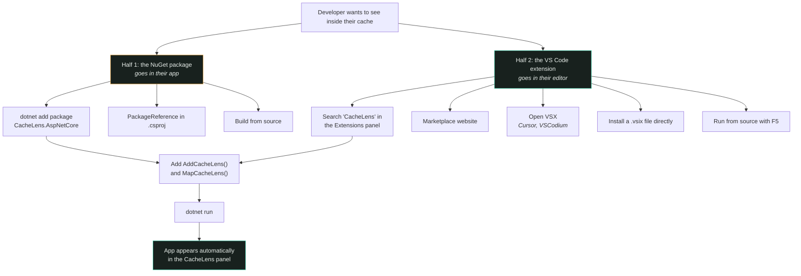

### Distribution channels

| Channel | What it carries | Audience |
|---|---|---|
| **NuGet.org** | `CacheLens.AspNetCore`, `CacheLens.Core` | Every .NET developer — `dotnet add package` |
| **VS Code Marketplace** | The extension | VS Code users |
| **Open VSX** | The same extension | Cursor, VSCodium, Gitpod — these cannot read the MS Marketplace |
| **GitHub Releases** | `.vsix` and `.nupkg` files | Air-gapped or corporate environments |
| **GitHub source** | Everything | Contributors, and anyone who wants to build it themselves |

Publishing to **both** the VS Code Marketplace and Open VSX matters: Microsoft's Marketplace
terms restrict other editors from using it, so Cursor and VSCodium users can only install from
Open VSX. Skipping it silently excludes a large slice of the audience.

### Requirements

| | |
|---|---|
| .NET | 8.0 or 9.0 |
| App type | ASP.NET Core (needs DI and a request pipeline) |
| VS Code | 1.85 or newer |
| Platforms | Windows, macOS, Linux |

---

## 12. Status and roadmap

**Verified working** — exercised end to end against the sample app:

- `IMemoryCache` tracking: keys, values, sizes, absolute and sliding expiry, per-key hit counts
- Zero-config discovery, tree view, value inspector, evict, clear, snapshot export
- Loopback + token auth, key redaction, payload caps

**Known limitations**, stated plainly:

| Limitation | Detail |
|---|---|
| `IMemoryCache` only | `IDistributedCache` and `HybridCache` are designed for but not built |
| Polling, not push | Refreshes every 3 seconds while the view is visible; no WebSocket yet |
| ASP.NET Core only | Console apps and worker services need a different hosting approach |
| No automated tests | Verification has been manual and reproduction-driven |
| Stale discovery files | Force-killed apps leave a file behind (see [§7](#7-zero-configuration-discovery)) |

**Roadmap**

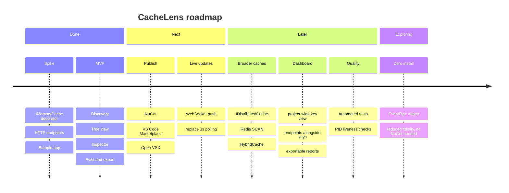

---

## Appendix — verification notes

The .NET API claims in [§1](#1-the-problem-honestly-stated) were checked by compiling a probe
against each target framework rather than relying on documentation, which is ambiguous about
which version introduced `MemoryCache.Keys`:

- `MemoryCache.Keys` on **net8.0** → compile error `CS1061`
- `MemoryCache.Keys` on **net9.0** → compiles and returns keys
- `IMemoryCache.Keys` on **net9.0** → compile error `CS1061` (interface does not expose it)

Sources: [MemoryCache Class](https://learn.microsoft.com/en-us/dotnet/api/microsoft.extensions.caching.memory.memorycache) ·
[MemoryCache.Keys Property](https://learn.microsoft.com/en-us/dotnet/api/microsoft.extensions.caching.memory.memorycache.keys) ·
[IMemoryCache Interface](https://learn.microsoft.com/en-us/dotnet/api/microsoft.extensions.caching.memory.imemorycache)
